# 🗺️ ATTACK SURFACE MAP
## The Glitch Dungeon - Visualisierung der Sicherheitslücken


## 🎯 ANGRIFFSKETTE - WORST CASE SCENARIO

```mermaid
sequenceDiagram
    participant Attacker
    participant Client
    participant API
    participant Redis
    participant Victim
    
    Note over Attacker: Phase 1: XSS Injection
    Attacker->>Client: Spiel mit Name:<br/><script>steal_cookies()</script>
    Client->>API: POST /leaderboard<br/>name: "<script>..."
    API->>Redis: STORE unsanitized name
    Redis-->>API: OK
    API-->>Client: Score submitted
    
    Note over Victim: Phase 2: Victim spielt
    Victim->>API: GET /leaderboard
    API->>Redis: FETCH leaderboard
    Redis-->>API: Returns data with <script>
    API-->>Victim: JSON with XSS
    Victim->>Victim: Renders name in HTML
    Note over Victim: 💥 SCRIPT EXECUTES!<br/>Cookies stolen
    
    Note over Attacker: Phase 3: DoS Attack
    loop 10000 times in 10 seconds
        Attacker->>API: POST /leaderboard<br/>huge payload
    end
    Note over API: 💣 Function Limits Exceeded
    Note over Attacker: 💰 Your Netlify Bill Explodes
    
    Note over Attacker: Phase 4: NoSQL Injection
    Attacker->>API: POST /leaderboard<br/>class: -1
    API->>Redis: KEYS[undefined]
    Note over Redis: 💥 Crash or Wrong Key
    Redis-->>API: Error / Wrong Data
```



## 🛡️ DEFENSE IN DEPTH - NACH FIXES


## 🔐 SECURITY LAYERS ERKLÄRT

### Layer 1: Client-Side Defense
- **sanitizeName()**: Entfernt HTML-Tags und gefährliche Zeichen
- **generateUID()**: Sichere UID-Generierung mit crypto API
- **Hardcoded HTTPS**: Verhindert Mixed Content Attacks

### Layer 2: Network Defense
- **CORS Whitelist**: Nur erlaubte Domains können API aufrufen
- **Request Size Limit**: Max 10KB verhindert Memory DoS
- **HTTPS Enforcement**: Keine unverschlüsselten Übertragungen

### Layer 3: API Gateway Defense
- **Rate Limiting**: Max 10 Requests pro Minute pro IP
- **IP Tracking**: Erkennt wiederholte Angriffe
- **Method Validation**: Nur GET/POST erlaubt

### Layer 4: Server Logic Defense
- **Type Validation**: Prüft ob String, Number, etc.
- **Range Validation**: Depth 0-1000, Moves > 0, etc.
- **Sanitization**: Entfernt XSS-Payloads serverseitig
- **Server Timestamp**: Client kann Timestamp nicht fälschen

### Layer 5: Database Defense
- **Connection Pooling**: Verhindert Connection Exhaustion
- **Auto-Cleanup**: Top 5 Only, alte Einträge werden gelöscht
- **Expiration**: Redis Keys expiren nach 90 Tagen

## 📊 RISIKO-MATRIX

```mermaid
quadrantChart
    title Security Risk Matrix
    x-axis Low Impact --> High Impact
    y-axis Low Probability --> High Probability
    quadrant-1 Critical Risks (Fix Now!)
    quadrant-2 Monitor Closely
    quadrant-3 Accept
    quadrant-4 Mitigate When Possible
    XSS Attack: [0.8, 0.9]
    NoSQL Injection: [0.85, 0.7]
    DoS Attack: [0.9, 0.95]
    Connection Leak: [0.5, 0.6]
    Error Leakage: [0.3, 0.4]
    Missing CSP: [0.4, 0.3]
    Google Fonts: [0.2, 0.3]
```

## 🎯 PRIORITÄTEN


---

## 💡 KEY TAKEAWAYS

1. **Defense in Depth funktioniert!** 
   - Mehrere Schichten fangen auf, was eine übersieht

2. **Client-Side Validation ist NICHT genug**
   - Kann umgangen werden → Server muss ALLES prüfen

3. **Rate Limiting ist essentiell**
   - Schützt vor DoS UND reduziert Kosten

4. **Sanitization an beiden Enden**
   - Client: Für UX (direkte Fehler)
   - Server: Für Security (letzte Verteidigung)

5. **Error Messages sind gefährlich**
   - Können Systeminformationen leaken
   - In Production immer generic halten
